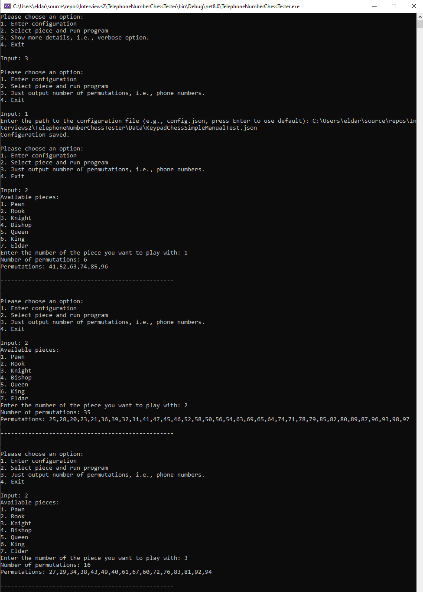

# Dynamic Chess Engine for Financial Asset Management Interview

## Overview
This repository contains a dynamic chess engine developed as part of a take-home programming interview for a position at a financial alternative asset manager. The engine is designed with extensibility and flexibility in mind, using a JSON configuration to dynamically define chess pieces, board layouts, and moves. This approach allows for adjustments to the game setup at runtime without the need to alter the code or restart the application.

## Original Instructions
The original PDF with detailed instructions and guidelines for this project can be found [here](./Chess.pdf).

## Features
- **Dynamic Configuration:** Chess board, pieces, and game moves can be configured dynamically using a JSON file. This makes the system adaptable and extensible to other types of games and scenarios.
- **Extensible Design:** The design supports various game types, board sizes, and piece types, enabling easy expansion and customization.
- **Test Console Application:** Includes a console application for testing the functionality of the chess engine.

## Results
The engine calculates the number of possible telephone numbers per chess piece based on their movements across the board:
- Pawn: 0
- Rook: 49326
- Knight: 952
- Bishop: 2341
- Queen: 751503
- King: 124908
- Eldar (Custom Piece): 5
- DoubleDownBoardPiece (complex IBoardPiece with non standard chess moves): 8

## Performance
I decided to add dynamic programming to my dynamic design using memoization (I love this word!). This problem lends itself to dynamic programming because the moves for any piece are the same so you really only have to calculate them once and use those cached values next time. The performance improvements, as expected, are huge. Most pieces are 3-5x faster; the knight is 8-10x faster. We see an outsized performance improvement for a knight because it does the same moves back and forth, per its specific movement. Here's a performance snippet screengrab.
- Note: I used PostSharp's AOP [Cache] to implement the caching [quickly].


## JSON Configuration
The JSON configuration file plays a critical role in defining the dynamics of the chess engine. It allows for the flexible specification of board layouts, piece movements, and game rules without altering the underlying codebase. Here's a breakdown of the key components:

- **Board:** Defines the layout of the chess board as a grid, where each array element represents a row.
- **Exclusions:** Sets conditions for excluding certain numbers from being valid moves, such as numbers containing specific characters or starting with certain digits.
- **Terminators:** Defines conditions under which a series of moves should terminate.
- **Pieces:** Specifies the types of pieces available and their respective movement patterns.

### Example Configuration [KeypadChessTest.json](./Data/KeypadChessTest.json):
```json
{
  "board": [
    [ "1", "2", "3" ],
    [ "4", "5", "6" ],
    [ "7", "8", "9" ],
    [ "*", "0", "#" ]
  ],
  "exclusions": [
    "p => p.Contains(\"*\") || p.Contains(\"#\")", // Exclude numbers containing * or #
    "p => p.StartsWith(\"0\") || p.StartsWith(\"1\")" // Exclude numbers starting with 0 or 1
  ],
  "terminators": [ "p => p.Length == 7" ],
  "pieces": [
    {
      "name": "Pawn",
      "moves": [ "u" ]
    },
    {
      "name": "Rook",
      "moves": [ "U", "D", "R", "L" ]
    },
    {
      "name": "Knight",
      "moves": [ "uur", "uul", "llu", "lld", "rru", "rrd", "ddl", "ddr" ]
    },
    {
      "name": "Bishop",
      "moves": [ "Q", "W", "S", "A" ]
    },
    {
      "name": "Queen",
      "moves": [ "U", "D", "R", "L", "Q", "W", "S", "A" ]
    },
    {
      "name": "King",
      "moves": [ "u", "d", "r", "l", "q", "w", "s", "a" ]
    },
    {
      "name": "Eldar",
      "moves": [ "ll", "rr" ]
    }
  ]
}
```

## Movement Mechanics

The chess engine uses a combination of lowercase and uppercase letters to define the movement patterns of pieces. Each piece has a set of valid moves represented in the JSON configuration.

### Move Definitions
- **Lowercase Letters (`u`, `d`, `r`, `l`, `q`, `w`, `s`, `a`):** These letters represent single-step movements in specific directions:
  - `u`: Up (North)
  - `d`: Down (South)
  - `r`: Right (East)
  - `l`: Left (West)
  - `q`: Upper-left diagonal (Northwest)
  - `w`: Upper-right diagonal (Northeast)
  - `s`: Lower-right diagonal (Southeast)
  - `a`: Lower-left diagonal (Southwest)

### Uppercase Letters (`U`, `D`, `R`, `L`, `Q`, `W`, `S`, `A`)
- Uppercase versions of the movement letters indicate the piece can move in the specified direction continuously until it reaches the edge of the board or encounters an obstacle. This is typically used for pieces like the Rook, Bishop, and Queen which can move multiple squares in a single move.

### Unhandled Moves: Mix of lowercase and uppercase
- Mix of lowercase and uppercase moves are not supported right now. For example, if you want to move a non-standard piece left once and then up one or more times (i.e., lU), this is not supported. This can be supported, if needed.

### Code Implementation
The `NextMoves` function in the engine determines possible next positions for a piece based on its current position and move patterns:

```csharp
public IEnumerable<IBoardPosition> NextMoves(IBoardPiece piece, IBoardPosition currentBoardPosition)
{
    foreach (string movePattern in piece.Moves)
    {
        int newRowIndex = currentBoardPosition.RowIndex;
        int newColIndex = currentBoardPosition.ColIndex;
        foreach ((int deltaRowIndex, int deltaColIndex) in piece.GetValidMoves(currentBoardPosition, movePattern))
        {
            newRowIndex = newRowIndex + deltaRowIndex;
            newColIndex = newColIndex + deltaColIndex;
            // Check if the new position is within the board bounds
            if (newRowIndex >= 0 && newRowIndex < Rows && newColIndex >= 0 && newColIndex < Cols)
            {
                yield return new BoardPosition(this, newRowIndex, newColIndex);
            }
        }
    }
}
```

## The moveMap defines the letter movements.

```csharp
/// <summary>
/// (row, column)
/// </summary>
private readonly Dictionary<char, (int, int)> moveMap = new Dictionary<char, (int, int)>
{
    {'u', (-1, 0)}, //NOTE: up is negative! becasue [0,0] is the top-left corner!
    {'d', (+1, 0)},
    {'r', (0, +1)},
    {'l', (0, -1)},
    {'q', (-1, -1)},
    {'w', (-1, +1)},
    {'s', (+1, +1)},
    {'a', (+1, -1)}
};

public IEnumerable<(int, int)> GetValidMoves(IBoardPosition boardPosition, string movePattern)
{
    (int, int) totalOffset = (0, 0); //no move yet
    foreach (char move in movePattern)
    {
        if (moveMap.TryGetValue(char.ToLower(move), out var offset))
        {
            // Handle uppercase moves indicating multiple steps
            if (char.IsUpper(move))
            {
                // Convert uppercase move to lowercase and repeat the move
                int repeatCount = 1;
                while (true)
                {
                    var repeatedOffset = (offset.Item1 * repeatCount, offset.Item2 * repeatCount); //repeated is for determining if off-board
                    repeatCount++;
                    if (!IsWithinBoard(boardPosition, repeatedOffset))
                    {
                        break;
                    }
                    yield return offset; //same incremental offset
                }
            }
            else
            {
                totalOffset = (totalOffset.Item1 + offset.Item1, totalOffset.Item2 + offset.Item2); //yield return offset;
            }
        }
        else
        {
            throw new ArgumentException($"Invalid move: {move}");
        }
    }
    if (IsWithinBoard(boardPosition, totalOffset)
        && !(totalOffset.Item1 == 0 && totalOffset.Item2 == 0))
    {
        yield return totalOffset; //return final offset / delta move
    }                
}
```

## Complex Board Pieces

To use non-standard chess pieces, you can also implement your own IBoardPiece and use that. The default board will call your IBoardPiece's GetValidMoves to get the next moves. This is demonstrated using the DoubleDownBoardPiece.cs class which simply doubles the current keypads value in searching for the next move. Here is that explicit implementation:

```csharp
public IEnumerable<(int, int)> GetValidMoves(IBoardPosition boardPosition, string movePattern)
{
    int boardPositionValue;
    if (!int.TryParse(boardPosition.Value.ToString(), out boardPositionValue))
    {
        boardPositionValue = 1;
    }
    IBoardPosition newBoardPosition = _board.AllPositions.Single(lmb => lmb.Value.ToString() == ((boardPositionValue * 2) % 10).ToString());
    (int, int) offset = (newBoardPosition.RowIndex - boardPosition.RowIndex, newBoardPosition.ColIndex - boardPosition.ColIndex);
    if (IsWithinBoard(boardPosition, offset))
    {
        yield return offset; //return final offset / delta move
    }
}
```

## Testing

To ensure the functionality and flexibility of the chess engine, it was tested using a specific JSON configuration tailored for manual testing. The `KeypadChessSimpleManualTest.json` configuration file was used, which incorporates a length terminator of 2 to demonstrate the engine's response to short movement sequences.

### Testing Configuration
The testing configuration employed is as follows:

```json
{
  "terminators": [ "p => p.Length == 2" ]
}
```

This configuration was designed to test the basic functionality of movement and terminators within the engine by limiting the length of possible move sequences to just two steps, simplifying analysis and debugging.

## Test Results
A screenshot of the test results, shown below, captured during the manual testing phase, is available in this repository. This image shows the outcome of the engine's calculations and is crucial for visual verification of the expected behavior.

This screenshot is an integral part of the testing documentation, providing a visual confirmation of how the chess engine handles configurations and moves as defined by the [KeypadChessSimpleManualTest.json](./Data/KeypadChessSimpleManualTest.json).



## Importance of Manual Testing
Manual testing allowed for immediate feedback on the engine's behavior in controlled scenarios, ensuring that all functionalities were performing as expected under varied configurations. This hands-on approach was vital for quick iterations and refinements of the engine's dynamic capabilities.

## Usage
Instructions on how to configure and use the chess engine are included in the JSON configuration file within this repository. Users can modify this file to test different configurations and scenarios without altering the core application.
